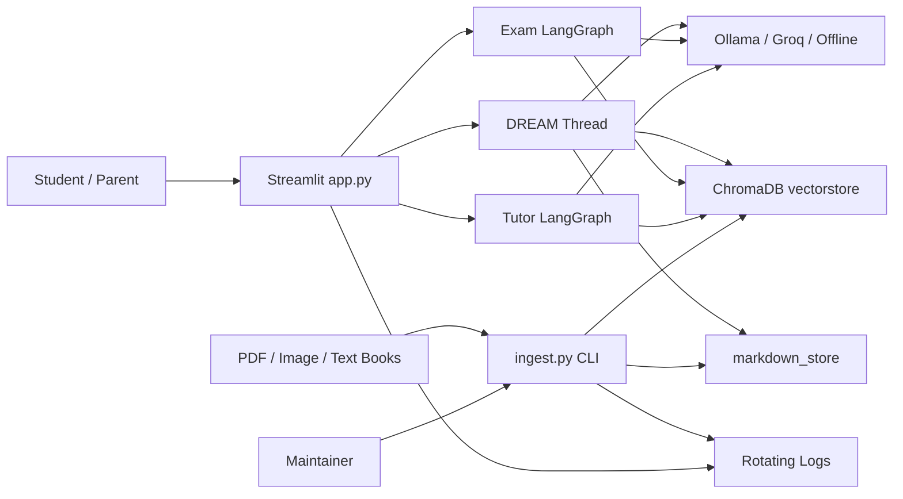
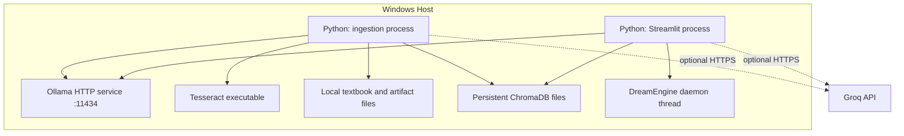
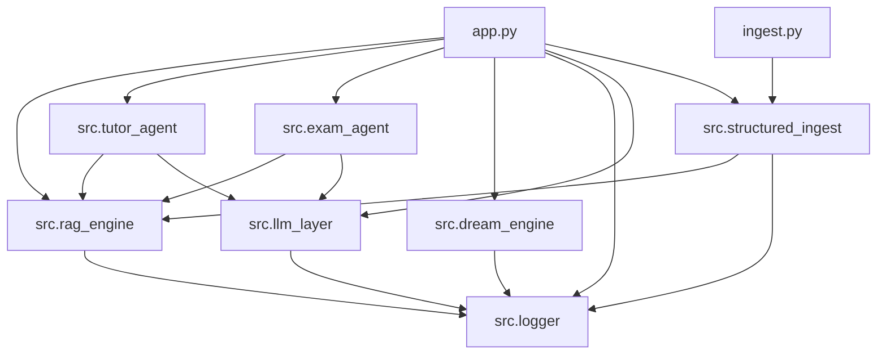
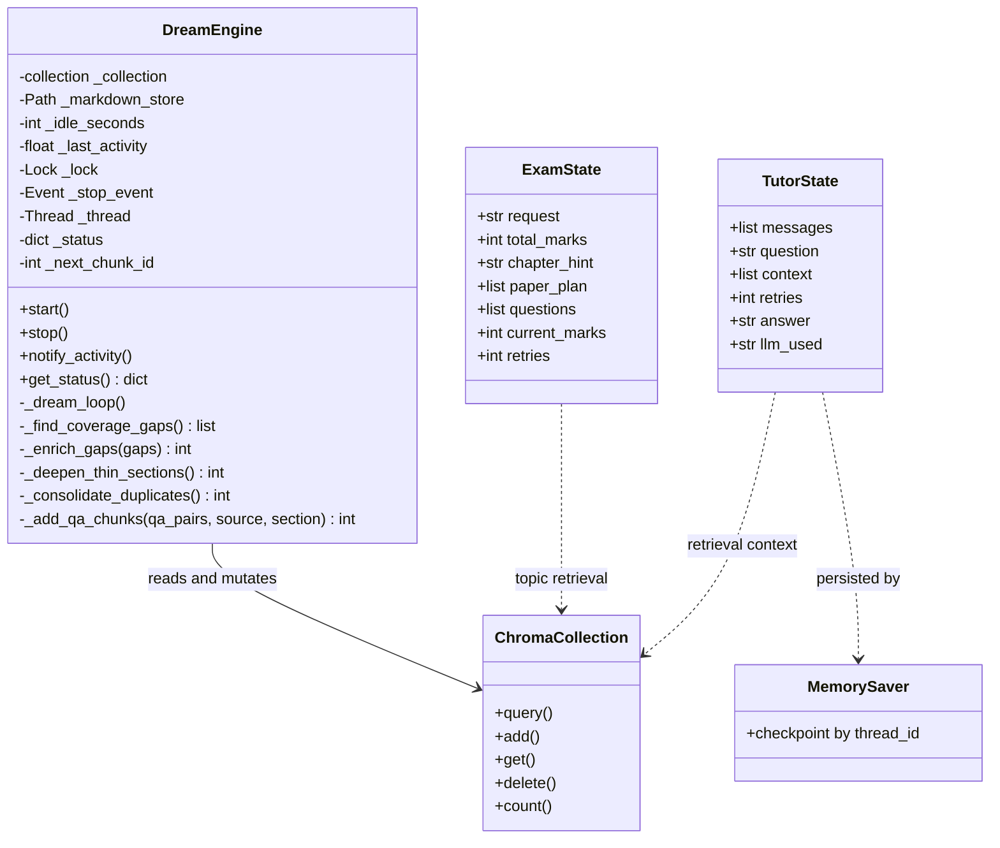
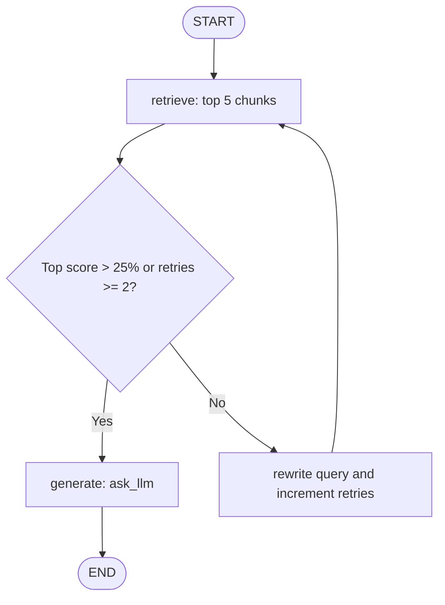
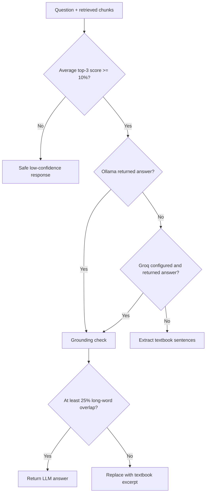
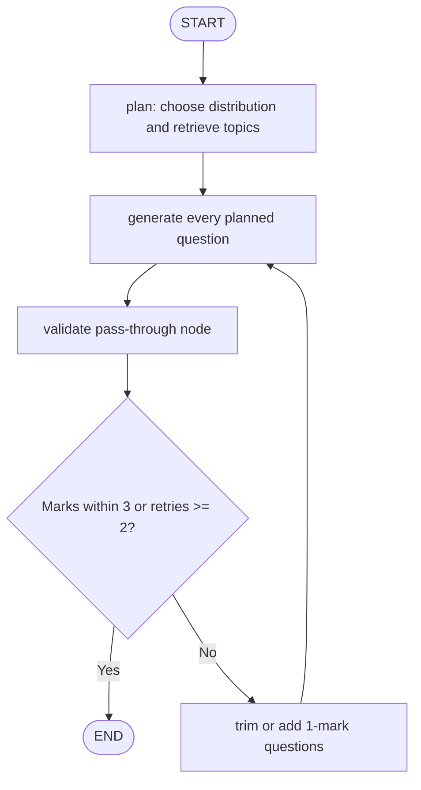
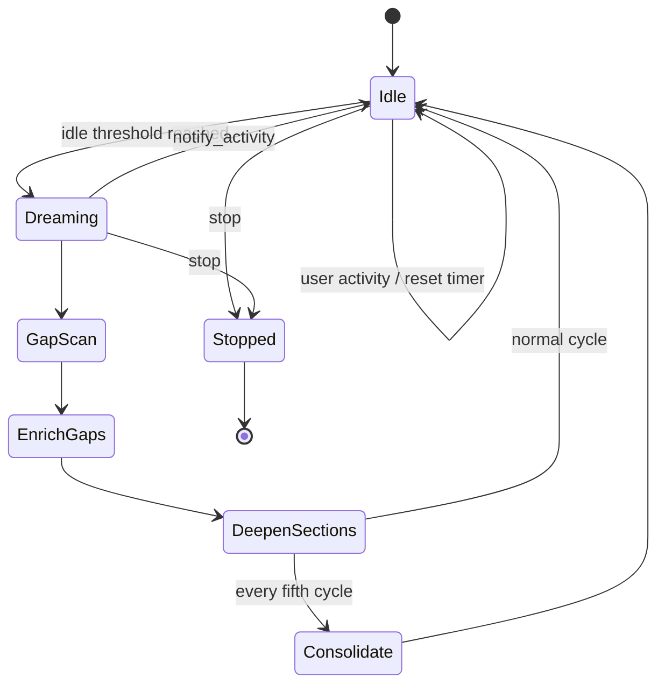
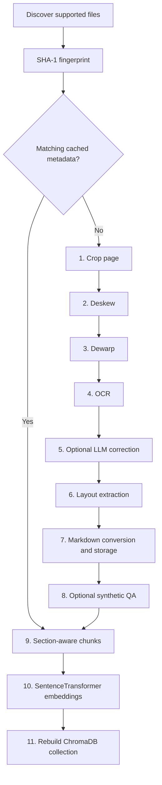
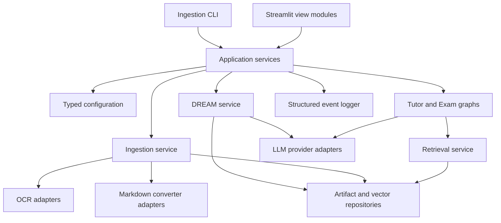

# AI Study Technical Design

**Scope:** Entire active codebase, including entry points, `src/` modules,
storage artifacts, utilities, and archived implementations.  
**Last updated:** 2026-06-14

## 1. Design Overview

AI Study is a local-first Python application with four runtime paths:

1. An offline ingestion command builds structured artifacts and ChromaDB.
2. A Streamlit application serves tutor, exam, monitoring, and DREAM views.
3. Two LangGraph state machines orchestrate tutor and exam requests.
4. A daemon-thread DREAM engine enriches the live vector collection while
   the application is idle.

The architecture favors graceful fallback: optional OCR engines, Markdown
converters, and LLM providers can fail without eliminating the offline path.

## 2. System Context



## 3. Runtime Deployment



## 4. Repository Structure

```text
AI_Study/
|-- app.py                         Streamlit UI and resource orchestration
|-- ingest.py                      Active 11-stage ingestion CLI
|-- ingest_old.py                  Legacy ingestion entry point
|-- diagnose.py                    OCR environment and sample diagnostics
|-- fix_tesseract.py               Tesseract locator and repair helper
|-- setup_python311.ps1            Python 3.11 PaddleOCR/Docling setup
|-- requirements.txt               Core runtime dependencies
|-- requirements-paddle.txt        PaddleOCR and Docling profile
|-- requirements-marker.txt        Optional Marker profile
|-- README.md                      Setup and user guide
|-- PIPELINE_UPGRADE.md             Structured ingestion migration notes
|-- AI_Study_Context_Prompts.docx   Existing project reference document
|-- logs/
|   |-- ai_study.log
|   |-- ocr_failures.log
|   `-- hallucination_guard.log
|-- markdown_store/
|   |-- <stem>.md                   Structured source content
|   |-- <stem>.json                 Ingestion metadata
|   `-- <stem>.qa.json              Generated QA pairs
|-- vectorstore/                    ChromaDB persistence, created at runtime
|-- src/
|   |-- __init__.py                 Package exports
|   |-- structured_ingest.py        Active ingestion pipeline
|   |-- rag_engine.py               OCR helpers, legacy ingestion, retrieval
|   |-- llm_layer.py                Providers and hallucination controls
|   |-- tutor_agent.py              Tutor LangGraph
|   |-- exam_agent.py               Exam LangGraph
|   |-- dream_engine.py             Idle background enrichment engine
|   |-- dream_integration.py        Historical copy/paste integration notes
|   |-- logger.py                   Central logging and dashboard counters
|   |-- architecture.md             Earlier architecture notes
|   |-- roadmap.md                  Earlier product roadmap
|   |-- skills.md                   Earlier capability inventory
|   |-- PRD.md                      Product requirements
|   `-- TECHNICAL_DESIGN.md         This document
`-- archive/
    |-- app_old.py
    |-- ingest_10062026.py
    |-- llm_layer_old.py
    |-- rag_engine_old.py
    |-- structured_ingest_old.py
    `-- requirements_old10062026.txt
```

Generated `__pycache__/` content is not part of the logical design.

## 5. Component Responsibilities

| Component | Responsibility | Key dependencies |
|---|---|---|
| `app.py` | UI, session state, graph loading, DREAM lifecycle | Streamlit, all service modules |
| `ingest.py` | Parse CLI options and invoke pipeline | `structured_ingest` |
| `structured_ingest.py` | Active OCR-to-vector pipeline | OpenCV, OCR engines, Docling/Marker, ChromaDB |
| `rag_engine.py` | Tesseract image pipeline, legacy loaders, shared retrieval | Pillow, OpenCV, pytesseract, ChromaDB |
| `llm_layer.py` | Provider routing, confidence gate, grounding check | Ollama HTTP, Groq HTTP |
| `tutor_agent.py` | Corrective RAG state machine | LangGraph, retrieval, LLM layer |
| `exam_agent.py` | Exam planning, generation, mark validation | LangGraph, retrieval, LLM layer |
| `dream_engine.py` | Idle coverage analysis and live enrichment | Threading, Markdown store, ChromaDB |
| `logger.py` | Rotating logs, specialized events, dashboard stats | Python logging |
| Utilities | Installation and OCR diagnosis | Tesseract, Pillow |

## 6. Module Dependency Diagram



The active UI loads the vector store through `rag_engine.load_vectorstore`.
The active ingestion command builds it through
`structured_ingest.build_vectorstore_from_chunks`. Both use collection name
`science_books` and `all-MiniLM-L6-v2`, preserving runtime compatibility.

## 7. Class and State Model

The codebase is primarily functional. `DreamEngine` is the only concrete
service class; LangGraph states are `TypedDict` contracts.



### 7.1 Retrieval Result

```python
{
    "text": str,
    "source": str,
    "page": str | int,
    "section": str,  # present in structured retrieval
    "score": float   # percentage derived from cosine distance
}
```

### 7.2 DREAM Status

```python
{
    "state": "idle" | "dreaming" | "stopped",
    "cycles_completed": int,
    "gaps_found": int,
    "chunks_added": int,
    "duplicates_removed": int,
    "last_dream_at": str | None,
    "last_gap_topics": list[str],
    "log": list[str],
    "idle_for_seconds": int,
    "idle_threshold": int,
    "seconds_to_dream": int
}
```

## 8. LangGraph Workflows

### 8.1 Tutor Workflow



Node contracts:

- `node_retrieve`: calls `rag_engine.retrieve`.
- `node_grade`: routes to generation or rewrite.
- `node_rewrite`: appends deterministic keyword expansion.
- `node_generate`: retrieves again if context is empty, then calls `ask_llm`.
- `build_tutor_graph`: compiles with `MemorySaver`.
- `ask_tutor`: invokes with `thread_id=session_id` and formats sources.

The LLM layer performs a second, independent confidence decision after the
graph's context grading.

### 8.2 LLM Guard Workflow



### 8.3 Exam Workflow



Important current behavior: `replan` modifies `questions`, then routes back to
`generate`, which regenerates from the unchanged `paper_plan`. This can discard
the direct adjustments made by `replan`. The intended design should either
modify `paper_plan` before generation or route adjusted questions directly to
validation.

### 8.4 DREAM Workflow

DREAM is not implemented with LangGraph. It is a thread-driven state machine:



## 9. Ingestion Pipeline



### 9.1 OCR Selection

- PDF pages are rendered with PyMuPDF at `AI_STUDY_PDF_DPI`, default 300.
- Structured ingestion attempts available advanced OCR engines and falls back
  to Tesseract helpers.
- `rag_engine.ocr_jpeg` independently evaluates multiple preprocessing
  variants and Tesseract PSM modes using a text quality score.
- OCR results are logged with method and word count.

### 9.2 Markdown Conversion

For PDFs, converter order is controlled by `AI_STUDY_PDF_CONVERTER` or the CLI:

1. `docling`
2. `marker`
3. built-in block-to-Markdown conversion

The built-in converter recognizes headings, bullets, definitions, answers, and
paragraphs, and writes page metadata as HTML comments.

### 9.3 Cache Semantics

- Fingerprint: first 12 characters of source SHA-1.
- Cache hit requires both `.md` and `.json` and a matching fingerprint.
- Existing `.qa.json` is loaded when available.
- `--force` bypasses cache reuse.
- All chunks are rebuilt into a fresh Chroma collection on every successful
  pipeline run.

### 9.4 Chunking

- Splits on level-two and level-three Markdown headings.
- Target maximum is 800 characters with 120-character overlap.
- Rejects chunks below 15 words or below 55% real-word ratio.
- Adds synthetic QA as separate `doc_type="qa"` records.

## 10. Storage Design

### 10.1 Markdown Store

The Markdown store is both a cache and an inspectable source of truth for
post-OCR content. DREAM also reads and mutates QA sidecars in this directory.

### 10.2 ChromaDB

- Persistence directory: `<project>/vectorstore`.
- Collection: `science_books`.
- Distance space: cosine.
- Embedding model: `all-MiniLM-L6-v2`.
- Ingestion currently deletes and recreates the collection.
- DREAM adds and deletes live records without a full rebuild.

### 10.3 Logs

| File | Purpose | Rotation |
|---|---|---|
| `ai_study.log` | General events and retrieval warnings | 2 MB x 3 backups |
| `ocr_failures.log` | Zero/low word OCR outcomes | 1 MB x 2 backups |
| `hallucination_guard.log` | Confidence and grounding decisions | 1 MB x 2 backups |

Dashboard metrics are currently calculated by counting strings in these files.

## 11. Module-Level Design

### 11.1 `app.py`

Responsibilities:

- Configure the Streamlit page and four tabs.
- Cache vector collection and compiled graphs.
- Own chat history and session ID.
- Start and control one DREAM engine in session state.
- Render tutor answers, exam papers, operational logs, and DREAM status.

Design constraints:

- The module executes UI code at import time, as expected by Streamlit.
- It should not be imported by tests without Streamlit isolation.
- Future refactoring should move each tab to a view module and move resource
  creation to an application service.

### 11.2 `structured_ingest.py`

Responsibilities:

- Own active ingestion configuration and artifact directories.
- Perform image geometry correction and OCR.
- Correct text, infer layout, convert Markdown, and generate QA.
- Create semantic chunks and ChromaDB.

Public API:

- `run_pipeline`
- `build_vectorstore_from_chunks`
- `load_vectorstore`
- `retrieve`
- constants `MARKDOWN_STORE` and `VECTORSTORE`

### 11.3 `rag_engine.py`

Responsibilities:

- Locate and configure Tesseract.
- Generate image preprocessing variants.
- OCR images and PDF pages.
- Provide legacy document loading, chunking, and vector building.
- Provide the retrieval function used by tutor and exam agents.

Technical debt:

- It overlaps substantially with `structured_ingest.py`.
- `src.__init__` references a legacy `load_pdfs` export while the active module
  defines `load_documents`; package import compatibility should be tested.
- Shared retrieval and OCR primitives should be extracted before removing
  legacy entry points.

### 11.4 `llm_layer.py`

Responsibilities:

- Confidence gate.
- Ollama and Groq provider calls.
- Offline extractive answer generation.
- Post-generation lexical grounding verification.
- LLM availability checks.

Provider order:

1. Ollama `gemma2:2b`
2. Groq `llama3-8b-8192`
3. Offline textbook excerpts

### 11.5 `tutor_agent.py`

Responsibilities:

- Define `TutorState`.
- Build corrective retrieval graph.
- Scope memory by session ID.
- Notify DREAM of user activity.
- Return UI-ready answer, engine, and source strings.

### 11.6 `exam_agent.py`

Responsibilities:

- Define `ExamState` and mark distributions.
- Retrieve topic statements.
- Generate question objects with LLM and rule-based fallbacks.
- Validate marks and group output by section.
- Notify DREAM of user activity.

Required redesign:

- Pass grounded context to exam LLM calls.
- Validate JSON with a schema.
- Ensure replan changes the plan, not transient generated questions.
- Remove off-domain hard-coded questions.
- Add duplicate and source-provenance validation.

### 11.7 `dream_engine.py`

Responsibilities:

- Manage daemon thread lifecycle.
- Detect idle time and weak retrieval topics.
- Generate gap QA and section QA.
- Mutate live Chroma records.
- Consolidate near-duplicate DREAM records.
- Expose thread-safe status.

Concurrency rules:

- `_lock` protects last activity and status mutations.
- `_stop_event` coordinates shutdown.
- Chroma collection safety depends on the underlying client implementation.
- A production design should serialize collection writes with ingestion and
  define what happens when the collection is rebuilt during a DREAM cycle.

### 11.8 `logger.py`

Responsibilities:

- Configure rotating handlers.
- Expose named application loggers.
- Record session, retrieval, OCR, and hallucination events.
- Derive basic dashboard counters.

Potential issue: repeated module reloads can attach duplicate specialized file
handlers because `_make_file_logger` does not check existing handlers.

### 11.9 Utilities and Archive

- `diagnose.py`: interactive environment checks and optional real-file OCR.
- `fix_tesseract.py`: locates the binary, runs a live test, and attempts a
  source patch for older `rag_engine` layouts.
- `setup_python311.ps1`: creates `.venv311` and installs the scanned-PDF stack.
- `dream_integration.py`: documentation snippets, not runtime code.
- `archive/` and `ingest_old.py`: historical reference only; exclude from
  runtime imports and test discovery unless explicitly testing migrations.

## 12. Configuration

| Setting | Source | Default |
|---|---|---|
| Textbook directory | `STUDY_SOURCE_DIR` | `<project>/study_materials` |
| PDF DPI | `AI_STUDY_PDF_DPI` | `300` |
| PDF converter | `AI_STUDY_PDF_CONVERTER` | `auto` |
| Groq key | `GROQ_API_KEY` | unset |
| OCR debug images | `STUDY_OCR_DEBUG` | off |
| Vector path in UI | code constant | `./vectorstore` |
| DREAM idle threshold | app selection / constructor | 120 seconds |

Recommended target: introduce `src/config.py` with a typed settings object and
make all paths absolute relative to `PROJECT_ROOT`.

## 13. Error Handling and Fallbacks

- OCR engine failures return the next available engine or log an empty result.
- Converter failures fall through to the built-in Markdown converter.
- LLM correction and QA generation fall back to rule-based behavior.
- Tutor provider failures fall back to direct textbook extraction.
- Per-file pipeline exceptions increment error counts and continue.
- DREAM catches cycle-level exceptions and returns to idle.
- Streamlit resource loading returns `None` graphs and displays setup guidance.

## 14. Security and Privacy

- Keep local Ollama as the default provider.
- Treat enabling Groq as consent to transmit prompt context externally.
- Do not write API keys to logs or artifact metadata.
- Avoid placing student names in session logs.
- Sanitize future uploaded filenames before using them in generated paths.
- Add file-size and page-count limits before accepting untrusted uploads.
- DREAM-generated knowledge should be marked as synthetic and auditable.

## 15. Testing Strategy

No active automated tests are present. Add:

### Unit Tests

- OCR scoring, text cleanup, classification, and chunk quality.
- Fingerprint cache decisions.
- Tutor rewrite and routing thresholds.
- Confidence and grounding checks.
- Exam mark distributions and replan behavior.
- DREAM section extraction and duplicate selection.

### Integration Tests

- Tiny fixture image/PDF through Markdown and chunk creation.
- Temporary Chroma collection build and retrieval.
- Tutor graph with fake collection and fake LLM.
- Exam graph with deterministic question factory.
- DREAM cycle with temporary Markdown and in-memory/fake collection.

### Contract Tests

- Retrieval result schema.
- Markdown metadata sidecar schema.
- Question JSON schema.
- DREAM status schema.
- Package import and public exports.

### End-to-End Tests

- Ingest fixture textbook, launch app services, ask known and unknown questions,
  generate both paper sizes, and verify logs.

## 16. Observability

Current observability is file-log based. The target design should add:

- Structured JSON events with event type and timestamp.
- Pipeline stage duration and error counts.
- Retrieval score distributions.
- Provider latency and fallback rates.
- Grounding failure rate.
- Exam validation failures and duplicate rate.
- DREAM additions grouped by source and approval status.

## 17. Key Technical Risks and Decisions

1. **Duplicated ingestion logic:** `rag_engine` and `structured_ingest` overlap.
   Keep active orchestration in `structured_ingest` and gradually extract shared
   OCR/retrieval services.
2. **Live vector mutation:** DREAM and ingestion can mutate the same logical
   store. Add a write lock or separate staging collection.
3. **Synthetic knowledge trust:** DREAM QA is model-generated from source but
   not independently grounded before insertion. Add provenance, verification,
   and optional approval.
4. **Exam grounding defect:** exam LLM calls currently provide no retrieval
   chunks to `ask_llm`, triggering the confidence gate. Refactor provider calls
   or pass source chunks.
5. **Threshold inconsistency:** graph grading uses 25%, while LLM gating uses a
   top-three average of 10%. Centralize retrieval policy.
6. **Import integrity:** package exports and legacy names need an automated
   import smoke test.
7. **UI coupling:** Streamlit state access inside agents couples domain logic
   to presentation. Replace with an activity callback or service event.

## 18. Recommended Target Architecture



This target preserves current behavior while separating UI, orchestration,
domain policy, provider adapters, and persistence. Migration should be
incremental and protected by the contract and integration tests above.
